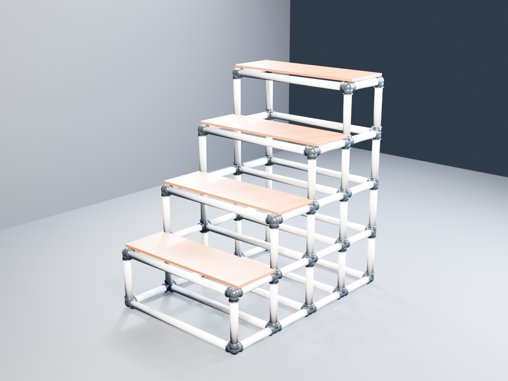

# Codex skills

Public Codex skills maintained by [bhadrip](https://github.com/bhadrip).

## Golu Padi Designer

`golu-padi-designer` creates connector-aware, dimensioned PVC Golu/Kolu display steps in Blender. It generates:

- an editable Blender file;
- a portable GLB;
- a connector-aware bill of materials;
- tailored, level-by-level assembly instructions;
- an exact connector orientation map;
- four inspection renders;
- dimensional QA and export re-import validation.

The included `examples/four-step-pvc` artifact uses exact 12-inch and 36-inch tube cuts with a documented generic socket allowance.

To install only this skill, copy `golu-padi-designer` into your Codex skills directory:

```sh
git clone https://github.com/bhadrip/skills.git
cp -R skills/golu-padi-designer "${CODEX_HOME:-$HOME/.codex}/skills/"
```

Then invoke it as `$golu-padi-designer` or describe a PVC Golu display design request naturally.

## Example render



## License

MIT. Physical builds require manufacturer-specific fitting measurements and independent structural/safety review.
