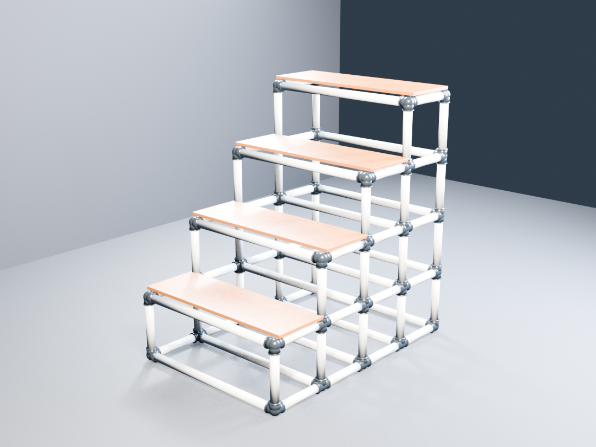

# Agent skills

Public agent skills maintained by [bhadrip](https://github.com/bhadrip). Product compatibility is documented by each skill.

## Portrait to Print plugin

[`portrait-to-print`](plugins/portrait-to-print/README.md) packages a local
photo-to-3D portrait workflow: multiview generation guidance, bounded agentic
sculpting, an experiment ledger, fixed-view Blender review, checked STL/GLB
exports, and printer-specific handoff. It can refine an existing head's nose,
smile or hairstyle without restarting generation.

The plugin contains **only reusable instructions, code and synthetic tests**—no
real-person photographs, portrait meshes, renders, facial measurements or
private project logs. Generation runtimes/weights and Blender are separate local
dependencies. It does not guarantee likeness or submit printer jobs. See its
[usage and privacy guide](plugins/portrait-to-print/README.md) and
[skill entrypoint](plugins/portrait-to-print/skills/portrait-to-print/SKILL.md).

## Meal Prep Agent

`meal-prep-agent` starts with a short household onboarding, then manages the full weekly loop: importing attributed recipes from URLs, creating non-destructive variations, proposing quick dinners, planning weekend prep and freezer reserves, consolidating shopping, guiding cooking, and learning from lightweight feedback. Each family defines its own goals, difficulties, dietary preferences, and constraints.

It keeps recipe, inventory, planning, shopping, cooking, and feedback concerns modular. A public, human-readable starter cookbook provides shared recipes, while personal recipes and household data remain separate. The included reference schemas define portable JSON records while shopper- and cook-facing views remain concise Markdown.

Read the [installation and usage guide](meal-prep-agent/README.md), browse the [shared starter cookbook](meal-prep-agent/assets/shared-recipes/README.md), invoke the skill as `$meal-prep-agent` in Codex or `/meal-prep-agent` in Claude Code, or ask naturally for a meal plan, recipe import, freezer check, shopping list, cooking guidance, or post-meal feedback update.

## Golu Padi Designer

`golu-padi-designer` has two capabilities: create or edit a connector-aware Blender design, and plan the physical build. It generates:

- an editable Blender file;
- a portable GLB;
- a connector-aware bill of materials;
- tailored, level-by-level assembly instructions;
- an exact connector orientation map;
- a stock-pipe shopping list and optimized cut plan;
- a reusable design manifest for later edits;
- a complete tools list, including the correct PVC cutter capacity;
- four inspection renders;
- dimensional QA and export re-import validation.

The included `examples/four-step-pvc` artifact uses exact 12-inch and 36-inch tube cuts with a documented generic socket allowance.

To install only this skill for Codex, copy `golu-padi-designer` into your personal skills directory:

```sh
git clone https://github.com/bhadrip/skills.git
mkdir -p ~/.agents/skills
cp -R skills/golu-padi-designer ~/.agents/skills/
```

Then invoke it as `$golu-padi-designer` or describe a PVC Golu display design request naturally.

## Example render



## License

MIT. Physical builds require manufacturer-specific fitting measurements and independent structural/safety review.
